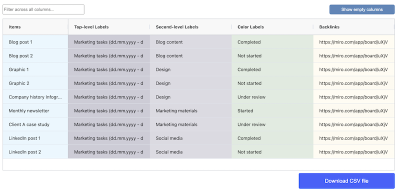

# Why Spatial Tables

Mappl.io Spatial Tables allows you to work with your data visually, directly within your Miro board.

It analyzes your board's content and presents it as a table that includes all extracted spatial information.

With this tool, you can categorize data using hierarchical structures, apply various tagging methods, label groups of sticky notes, or use connector lines to define relationships.

It effectively transforms your Miro board into a database.

**This is all you have to do**

Use one of our included statial table examples or Miroverse templates. This example uses the color of sticky notes to assign task status.

<figure><figcaption></figcaption></figure>

The view the the same data as a table, modify the table as neede, and export as a .CSV file.

<figure><figcaption></figcaption></figure>
