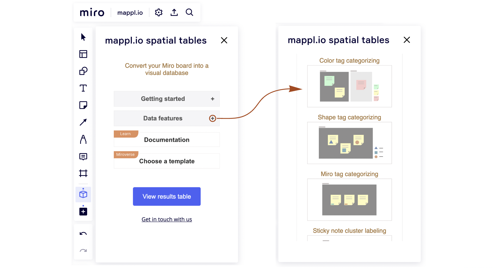
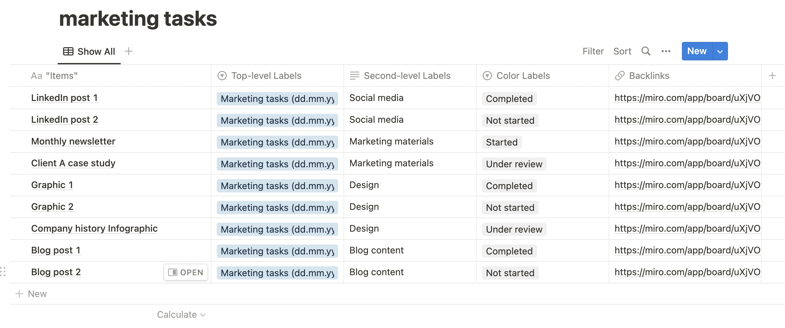

# Getting started

### What is mappl.io spatial tables

This is a [Miro app](https://miro.com/marketplace/spatial-tables/) that allows you to work with your data visually and intuitively, directly within your Miro board.

<figure><figcaption></figcaption></figure>

It analyzes your board's content and presents it as a table that includes all extracted spatial information.

With this tool, you can categorize data using hierarchical structures, apply various tagging methods, label groups of sticky notes, or use connector lines to define relationships.

It effectively transforms your Miro board into a database.

### **Work visually and then convert your data to an exportable table**

1\) Use one of our included spatial table examples or [Miroverse templates](https://miro.com/miroverse/search/?term=mappl.io). The example below is included in the app and uses the color of sticky notes to assign task status.

<figure><figcaption>
An example of a spatial table using color tags
</figcaption></figure>

2\) After you are done working with the data visually, convert it to a table and [sort](results-tables/sort.md) and [filter ](results-tables/filter.md)it as needed. Look at the example below. Note how the table categorizes each sticky note hierarchically, as well as it terms of color tags.

<figure><figcaption>
An example of a results table
</figcaption></figure>

### Pick your favorite external application to function as a data repository for your visual Miro data

Click on the [Download CSV file ](export/csv-export.md)button and then import the data to your favorite app. You can use applications such as [Microsoft Excel](export/export-to-excel.md), Google Sheets, [Notion](export/export-to-notion.md), [Airtable](export/export-to-airtable.md) and Coda as data repositories for your visual data. The backlinks included in the results tables always lead back to the original objects in your Miro boards.

<figure><figcaption>
The results table has been imported into Notion
</figcaption></figure>
