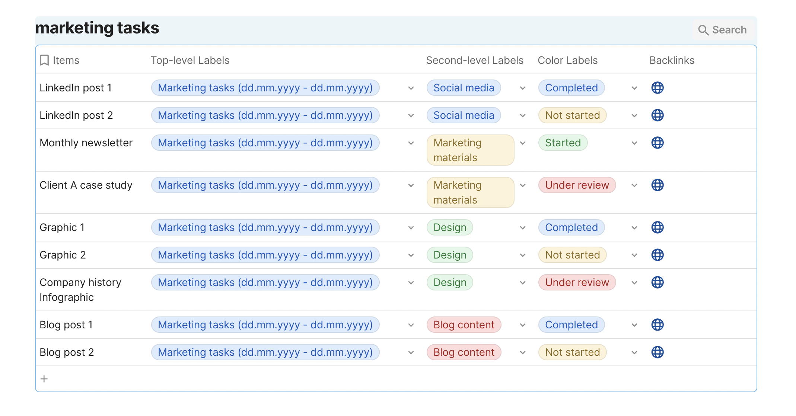

# Coda

**Use Coda as a data repository for your Miro data.** Work with separate tables for CSV file import or build a master table by appending many CSV files with a shared format. You can, for example, build a master table for all tasks in your project for an extended period of time, where you will always be able to find a particular task and go back to the original Miro board item by following the backlink.

<figure><figcaption></figcaption></figure>
