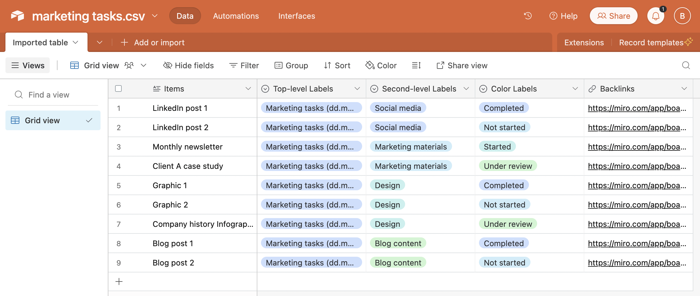
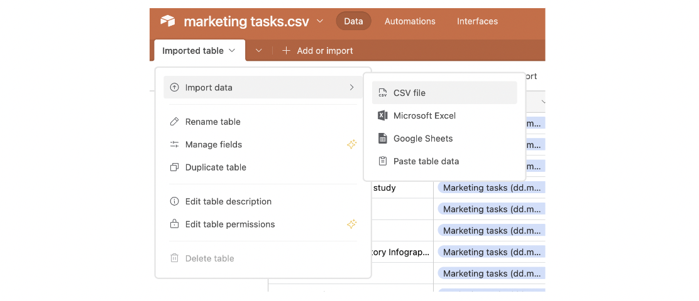

# Airtable

**Use Airtable as a data repository for your Miro data.** Work with separate tables for CSV file import or build a master table by appending many CSV files with a shared format. You can, for example, build a master table for all tasks in your project for an extended period of time, where you will always be able to find a particular task and go back to the original Miro board item by following the backlink.

<figure><figcaption>
Example of important data from mappl.io Spatial Tables into Airtable
</figcaption></figure>

1. Create a new table in your Airtable base.
2. Click the "+ Add or Import" button at the top of the table.
3. In the pop-up, choose "CSV file".
4. Select a previously saved CSV file from mappl.io Spatial Tables results table view and click Upload.
5. Review the imported data in the preview screen that appears. Make sure that the column on the left is the Title column. The Title column must be of type Long text, the Backlinks column must be of type URL, and the rest of the columns should be of type Single Select. You can click on the downward arrow and adjust the type at this time.&#x20;
6. Click Import and the data must be successfully imported in Airtable.

### Appending CSV Data to an Existing Airtable Table

1. Open the Airtable table where you want to append data.
2. Click on the downward arrow of the table table tab
3. In the pop-up, choose _Import data_, and then _CSV file_

<figure><figcaption></figcaption></figure>

4. Select the CSV file you want to append.
5. The new data rows are now added to the master table.
