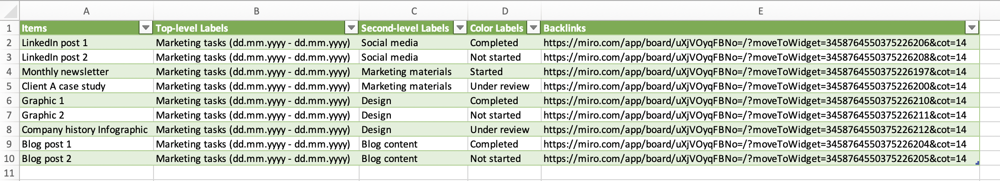

# Excel

**Use Excel as a data repository for your Miro data.** Work with separate worksheets for CSV file import or build a master worksheet by appending many CSV files with a shared format. You can, for example, build a master worksheet for all tasks in your project for an extended period of time, where you will always be able to find a particular task and go back to the original Miro board item by following the backlink.

<figure><figcaption></figcaption></figure>

### Creating a New Excel Worksheet from a CSV File:

The precise steps vary in different versions of Excel, so below we list the general steps that should be followed.&#x20;

1. Open Excel and create a new workbook.
2. Click on the "Data" tab in the ribbon.
3. Choose Get Data and then select Text/CSV.
4. Select a previously saved CSV file from the results table.
5.
6. In the "Text Import Wizard", review the data settings and then click Transform Data
7. Find Home ribbon that opens, select Use _first row as headers_
8. Click on the _Close & Load_ button to close the window to view the imported data in your worksheet.&#x20;

### Appending CSV Data to an Existing Excel Table

New CSV data can be appended to an existing table in a number of ways in Excel. Below we only list the simplest approach, which involves creating a new table and copying and pasting the data. Consult Excel documentation about more advanced methods such as combining CSV files form the same folder or using macros to achieve the same goal.&#x20;

1. Add the CSV data to a new Excel worksheet by following the steps in the previous section.&#x20;
2. Select all data in the worksheet excluding the title row and Copy the data
3. Go the the Worksheet containing your master table, click on the first empty cell below the last row with data and Paste the data into place.

