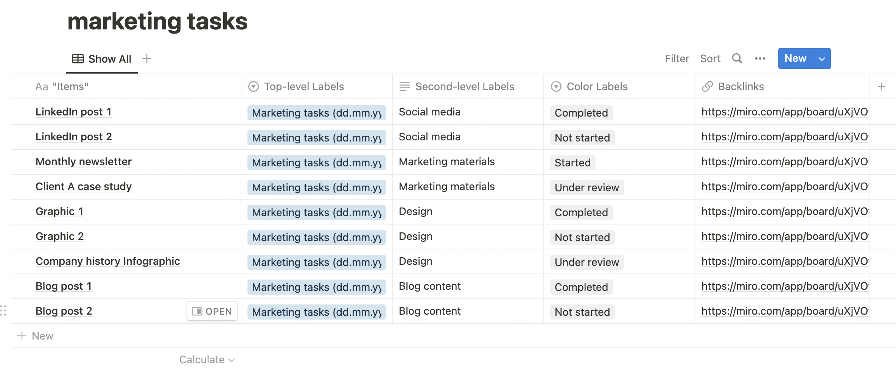

# Notion

### Follow these steps to create a new page and import a CSV file into Notion

1. Create a new page in your Notion dashboard.
2. Rename the page and click "+ Add new", then select "Import".
3. In the pop-up, choose "CSV".
4. Select a previously saved CSV file from the results table.
5. Review the imported data in Notion.

<figure><figcaption></figcaption></figure>

### Modifying Notion Table Column Properties

Make sure that the Items and Backlinks columns are of the right data type

1. Check column data types.
2. Make sure "Items" is set to the mandatory "Title" property in Notion (you should see Aa "Items")
3. Ensure "backlinks" has the "URL" data type.

#### To change a column property from "Text" to "Select":

1. Click the column header.
2. Select "Type" from the drop down menu that opens and choose "Select".

### Appending CSV Data to an Existing Notion Table

Use Notion as a data repository for your visual Miro data by appending new rows to a master table:

1. Open the Notion page with the master table.
2. Click the three-dot menu (top left).
3. Select "Merge with CSV" from the dropdown.
4. New data rows are added to the master table.

