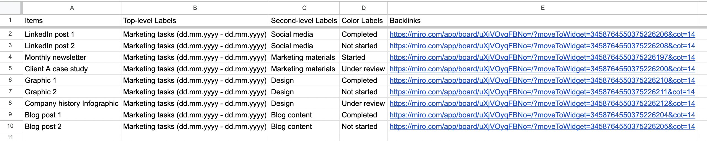

# Google Sheets

**Use Google Sheets as a data repository for your Miro data.** Work with separate worksheets for CSV file import or build a master worksheet by appending many CSV files with a shared format. You can, for example, build a master worksheet for all tasks in your project for an extended period of time, where you will always be able to find a particular task and go back to the original Miro board item by following the backlink.

<figure><figcaption></figcaption></figure>

1. Open Google Sheets and create a new, blank spreadsheet.
2. Click on _File_ in the menu, and then choose _Import_.
3. In the _Import_ window, select the _Upload_ tab and select your file from your device
4. In the _Import file_ settings dialog, choose _Insert new spreadsheet_ or _Replace spreadsheet_ under the _Import location_ options, depending on your preference.
5. Leave Detect automatically as default  under _Separator type_ which will  correctly identify the CSV format.
6. Click on the _Import data_ button.&#x20;
7. You will notice a new _File imported successfully. Open now_ option appear in the window. Click on _Open now t_o open the new data sheet.

### Freeze the header row

To make working with you data easier, we recommend freezing the first row of the sheet with the column titles.&#x20;

1. Select the first row&#x20;
2. Select View -> Freeze -> 1 row

### Appending CSV Data to an Existing Google Sheet table

1. Open a master table with existing data
2. Select _File_ -> _Import_
3. Select the CSV file under the _Upload_ tab
4. In the Import file window, under the Import location drop down menu, select _Append to current sheet_
5. Click on the Import data button

