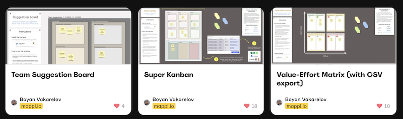

# How to access templates

Get started quickly using the mappl.io Spatial Tables app by choosing a compatible Miroverse template.

### To find  a selection of templates:

1. Launch the app.
2. Select "Choose a template."
3. Browse and pick the perfect template for your project.
4. Modify the temple as needed to best suite your particular requirements and datasets.

<figure><figcaption>
Selection of <a href="https://miro.com/miroverse/search/?term=mappl.io">compatible Miroverse templates</a>
</figcaption></figure>
