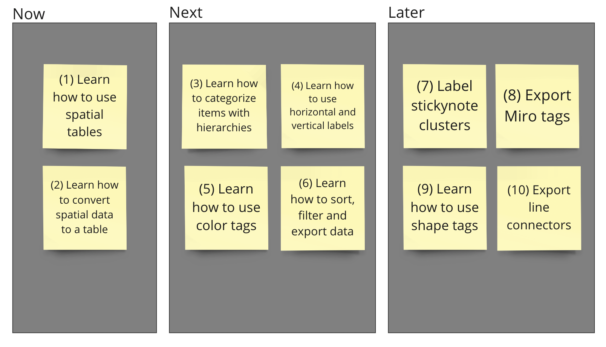
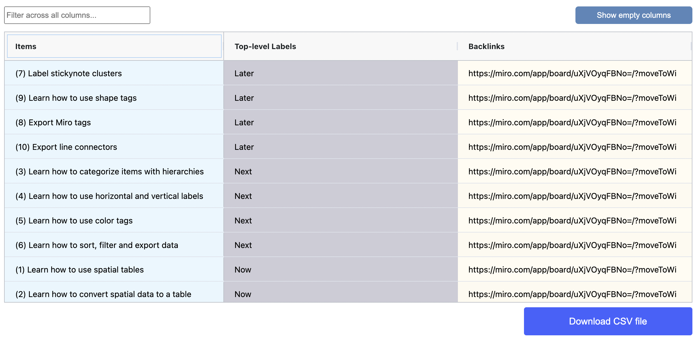

# Your first spatial table

Follow these steps to get going quickly with the mappl.io Spatial Tables app.

Open the app by choosing it from the list of installed apps in your left Miro Creation toolbar.

### Open the spatial table

1. <mark style="background-color:blue;">Navigate to an empty area in your Miro board</mark>, as new items will be placed in this area.
2. Select the "Getting Started" drop-down menu
3. Click on the button in this section, read through the information and made available to you on the pop-up page that opens, and then click the OK button once the page has fully loaded.&#x20;
4. Take a moment to examine the spatial table that appears on your Miro board. This is a very simple spatial table, but it effectively illustrates how you can describe information visually. The table shows some of the steps you can take to master using the mappl.io Spatial Tables app.

<figure><figcaption></figcaption></figure>

5. Notice how sticky notes are utilized as data points, representing individual pieces of information.
6. Observe the use of rectangle shapes and text boxes to assign categories, which help organize and group related data points for better understanding and analysis.

### View the results table

1. Use your mouse to select all content that should be included in the data analysis. The selection should cover everything included in the image from the previous section (labels, rectangles, and sticky notes).
2. Click on the "View Results Table" button located in the app panel.

<figure><figcaption></figcaption></figure>

3. Examine the regular table that opens to view your data items and label categories.
4. Notice how the table provides a structured view of your information, making it easy to read and analyze.
5. Observe how data items and label categories are organized and displayed in a clear and concise format for efficient information retrieval and analysis.


Note that you can change the column width by moving their edges in the header. You can also [sort](../results-table-output/sort.md) and [filter ](../results-table-output/filter.md)the table.


6. Click on the Download CSV file button to download the file which you can then open in another application such as a MS Excel, Google Sheets, Notion, or Airtable. These applications can be used as your data repository.
