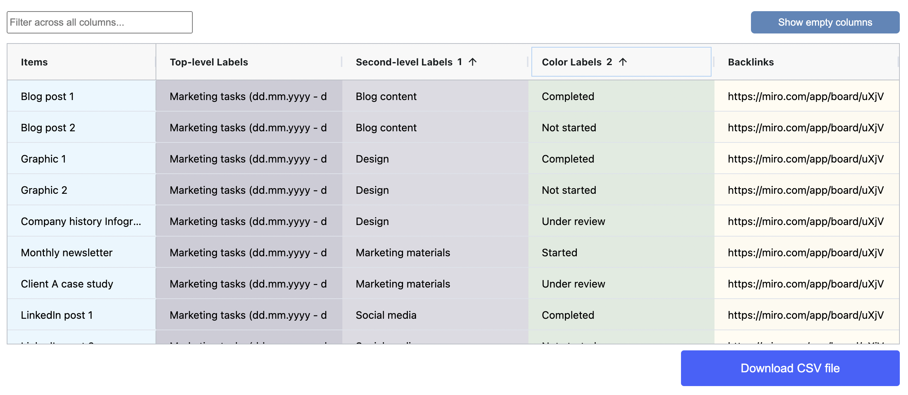

# Sort

You will often want to sort the data in the results table before export to make sure that it is in the most usable format.

### Sorting a single column

To sort the data in the results table, you can click on the column header of the column you want to sort.&#x20;

The sorting applied will be shown by an arrow in the header. By default, a column with no manual sorting applied does not show an arrow. When you click on a column header once, an upward arrow will appear and the column will be sorted in ascending order. Clicking on the same column header again will make a downward arrow appear, and the column will be sorted in descending order.

&#x20;If you click the column header a third time, the sorting will go back to its default state.

### Sorting multiple columns

You can sort multiple columns simultaneously by following these steps:&#x20;

1. Sort the first column as described above.&#x20;
2. Hold down the shift button and click on the second column you would like to sort. The number "2" will appear in the second column, and you will be able to sort it in ascending or descending order. The second sort will be applied after the first sort.

In the example below, sorting has been applied to the second-level vertical label column showing names of competitors (Competitor A, Competitor B) and the horizontal labels column showing Competitive advantages, Strengths and Weaknesses for each competitor.

<figure><figcaption></figcaption></figure>
