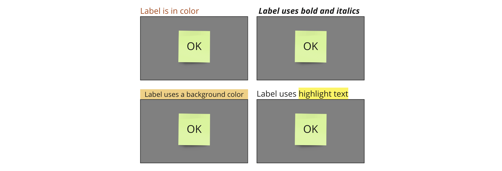

# Practical tips

### Assigning vertical labels

<figure><figcaption></figcaption></figure>

<figure><figcaption></figcaption></figure>

<figure><figcaption></figcaption></figure>

<figure><figcaption></figcaption></figure>

<figure><figcaption></figcaption></figure>

### Assigning horizontal labels

### Working with sticky note and text box data items

### Assigning with color tags

### Assigning with shape tags

### Assigning sticky note cluster labels
