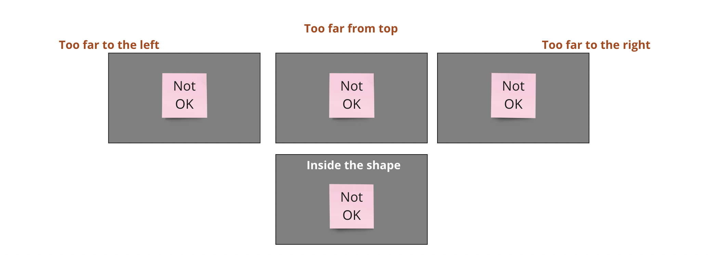

# Practical tips

### Assigning vertical labels

<figure><figcaption></figcaption></figure>

<figure><figcaption></figcaption></figure>

<figure><figcaption></figcaption></figure>

<figure><figcaption></figcaption></figure>

<figure><figcaption></figcaption></figure>

### Assigning horizontal labels

### Working with sticky note and text box data items

Sticky notes and text boxes serve as fundamental data types within Miro's spatial tables. Each sticky note is treated as a distinct data item, while a text box will be interpreted as such unless it is first interpreted as a label.&#x20;

To be associated with a parent category, data items must be contained within its corresponding shape. It is important to note that data items are always associated exclusively with their immediate parent shape, and should not overlap the boundary of the shape. Always select a shape to see its true boundary and ensure proper alignment of data items.

### Working with color tags

The definition of color tags requires the use of a specific vertical category label. This label, along with its associated shape, functions similarly to a map legend, where the different color tag labels will be specified.

Each color tag label is described by a sticky note placed inside the associated shape. The text content of each sticky note represents the label, and the color of the sticky note corresponds to the tag color that will be associated with the label.


When defining a vertical label as a color tag legend label, it should be named with one of the following exact strings: "color tags", "colour tags", "Color tags", "Colour tags", "color legend", "colour legend", "Color legend", or "Colour legend".


### Working with shape tags

To use shape tags, you need to define a vertical label category that will act as a legend for the shape tag labels. This category label and its associated shape define the area where shape tags and their corresponding labels will be placed.


The category label must have one of the following exact string names: "Shape tags", "Shape Tags", or "shape tags".


### Assigning labels to sticky note clusters
