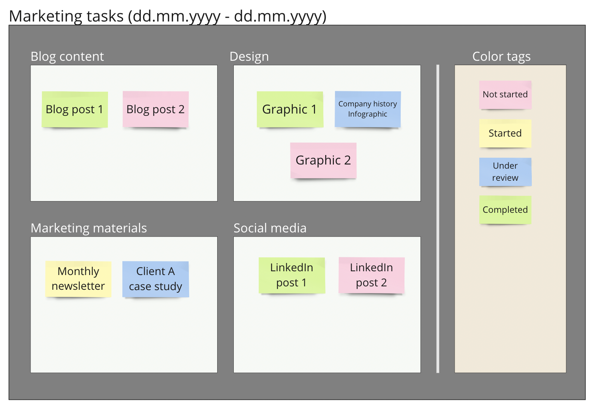

# Categorize items by color

Use custom color tags to track the changing state of data items in your spatial table. You can use this feature to indicate the completion state of tasks, as well as track other parameters such as the importance of items or the satisfaction level of customers.

Define as many states as you line by adding colored sticky notes with the appropriate label under a Color tags category.

This technique can be great alternative to Kanban boards, as it uses color to indicate state of task completion, while allowing for labeled rectangles to show supplementary task characteristics.

The example below shows how this approach can be used to track marketing tasks for a team. The states of completion are defined in the Color tags areas.&#x20;

<figure><figcaption></figcaption></figure>

#### Results table view

The color status for each item in the results table appears in the Color Labels column. Such a column will only be visible by default if the associated spatial table contains a Color tags label category.

Color tags can be used alongside other categorization methods supported by the app. The table below, for example also shows a two level vertical category hierarchy.

<figure><figcaption></figcaption></figure>
