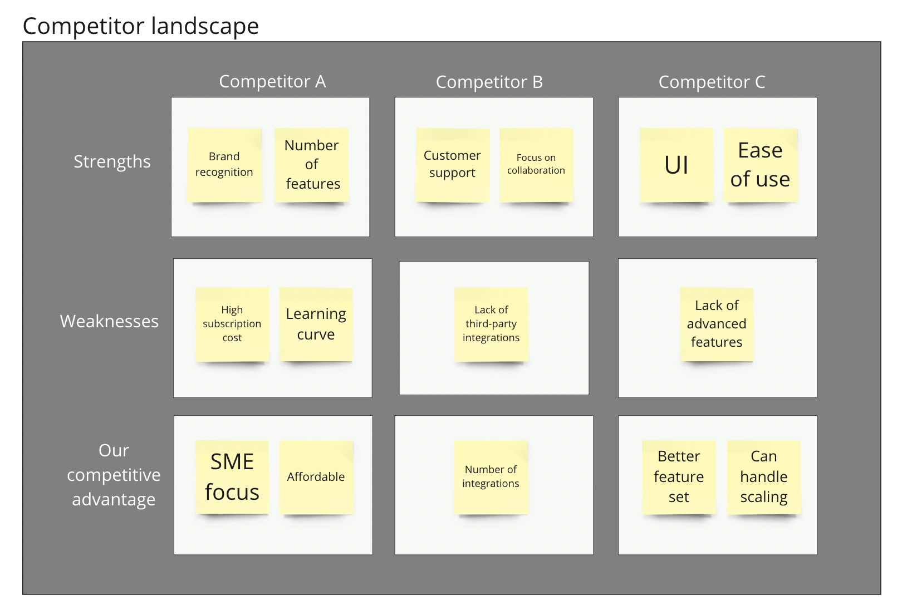
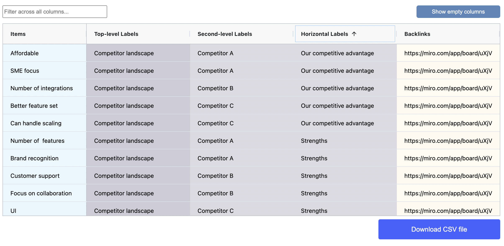

# Categorize items by using row and column labels

Place data items (sticky notes or text boxes) in rectangles associated to both vertical and horizontal labels. Work visually within a familiar table view.&#x20;

Take advantage of the spatial table's ability to include multiple items per cell, which can be examined later in the results table view.&#x20;

Use this technique to compare data items across diverse categories and identify items with similar or distinct features.&#x20;

The spatial table below illustrates a straightforward example of employing this approach to analyze the strengths and weaknesses of competitors, as well as your primary competitive advantage relative to them

<figure><figcaption></figcaption></figure>

The results table view resolves the vertical categories using [hierarchies](categorize-using-hierarchies.md). Horizontal labels are included in a separate column.

<figure><figcaption></figcaption></figure>
