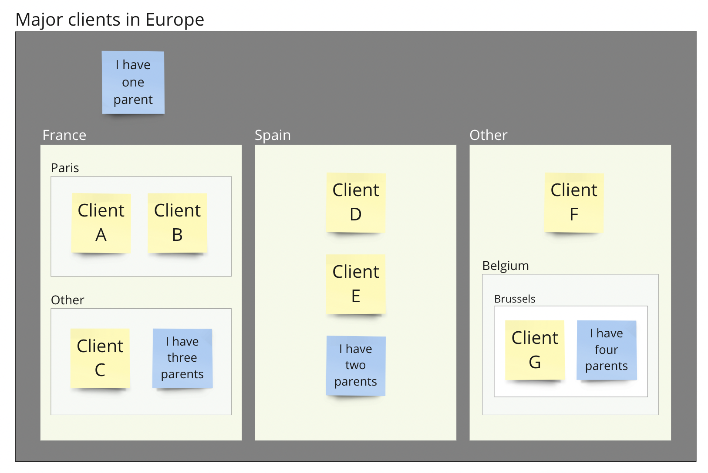
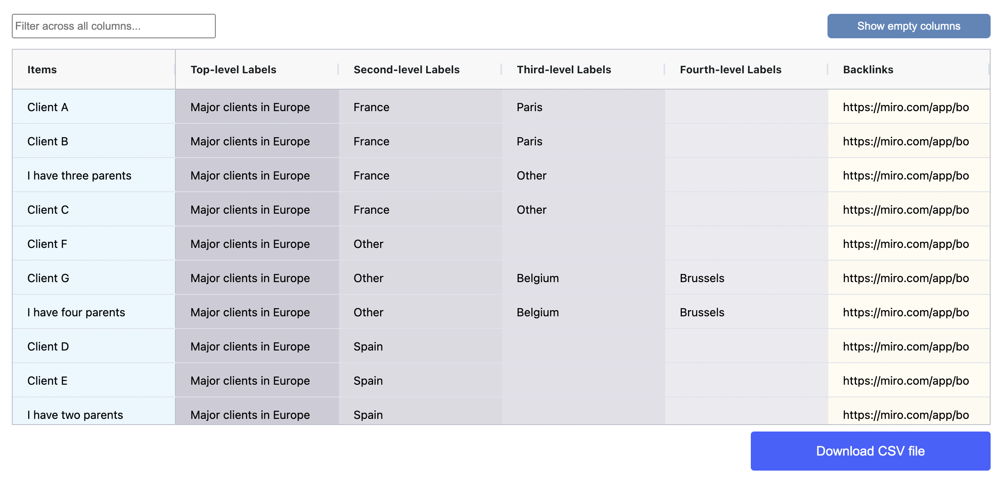

# Categorize items using nested shapes

Organize your data by categorizing items into up to five visual hierarchy levels based on nested shapes. Establish clear parent-child relationships between items. Place similar items in the same category.

Utilize this method for various practical applications, such as organizing brainstorming session results, managing project status or doing competition research.&#x20;

With this structure, you can quickly identify patterns, connections, and insights, making your decision-making process more efficient and well-informed.

The spatial table below illustrates how you can use nesting of labelled rectangles to associated clients with specific countries and cities within Europe. Client G in this case will be associated with Brussels -> Belgium -> Other -> Major clients in Europe.

<figure><figcaption></figcaption></figure>

#### Results table view

The spatial table gets converted to a regular table that can be [exported as a CSV file](../export/csv-export.md). The hierarchy is described by the included Top-level, Second level, Third-level and Fourth-level Labels. Backlinks can be used to go back to the original item on your Miro board. Data can be [filtered ](../results-tables/filter.md)and [sorted ](../results-tables/sort.md)prior to export.&#x20;

<figure><figcaption></figcaption></figure>

<table data-view="cards"><thead><tr><th></th><th></th><th></th><th data-hidden data-card-target data-type="content-ref"></th></tr></thead><tbody><tr><td></td><td>Practical tips for working with visual data</td><td></td><td><a href="../visual-data-input/practical-tips.md#assigning-vertical-labels">#assigning-vertical-labels</a></td></tr></tbody></table>
