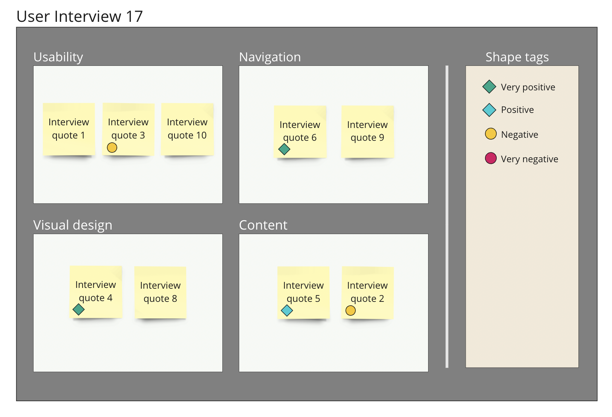

# Tag items using shapes

Use custom shape tags to assign additional label categories to sticky notes in your spatial tables.&#x20;

This feature allows you to quickly define and apply tags to your data sets by copying and pasting shapes on top of sticky notes. It's a simple and fast way to visually organize and categorize your data.

<figure><figcaption></figcaption></figure>

<figure><figcaption></figcaption></figure>
