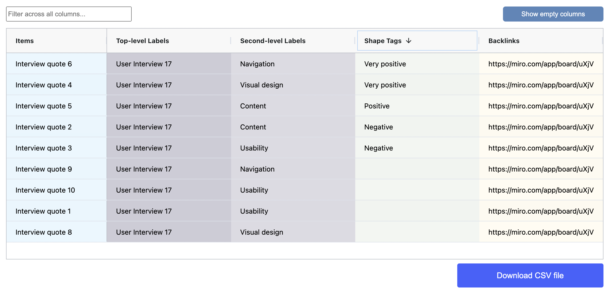

# Tag items using shapes

Use custom shape tags to assign label categories to sticky notes in your spatial tables. This feature enables you to quickly define and apply tags to your data sets by copying and pasting shapes on top of sticky notes, providing a simple and fast way to visually organize and categorize your data.

Shape tagging is especially useful when you need to keep track of and assign multiple tags simultaneously. You can use this feature to assign tasks to people or associate tasks with additional labels.

In the spatial table example below, shape tags are used to indicate the level of user enthusiasm during a moment in a user interview.

<figure><figcaption></figcaption></figure>

#### Results table view

The shape tags for each item in the results table appears in the Shape Tags column. Such a column will only be present if the associated spatial table contains a Shape tags label category.

Shape tags can be used alongside other categorization methods supported by the app. The table below, for example also shows a two level vertical category hierarchy.&#x20;

<figure><figcaption></figcaption></figure>


When you apply multiple shape tags to a single sticky note in a spatial table, each tag is resolved as a separate row in the results table. This feature makes filtering and querying data much easier.

