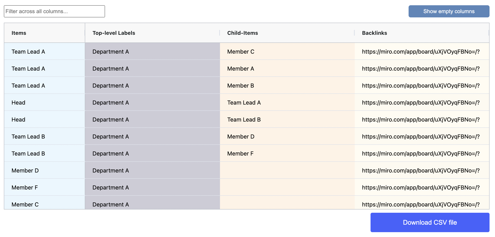

# Use connector lines

Use connector lines when you need create a direct parent-child relationships between individual sticky notes or text boxes. Connector lines are especially useful when the relationship lays outside of the a hierarchy structure used in the spatial table. They can, for example, show dependencies between data items belonging to different labelled hierarchical categories.&#x20;

The example below show a simple scenario where connector lines have been used to define the organizational structure within a department.&#x20;

<figure><figcaption></figcaption></figure>

#### Results table view

The results table displays the relationship between parent and child items in the Child-items column, which is only visible if the spatial table includes line connectors. The column illustrates how each child item is linked to its respective parent item.

<figure><figcaption></figcaption></figure>
