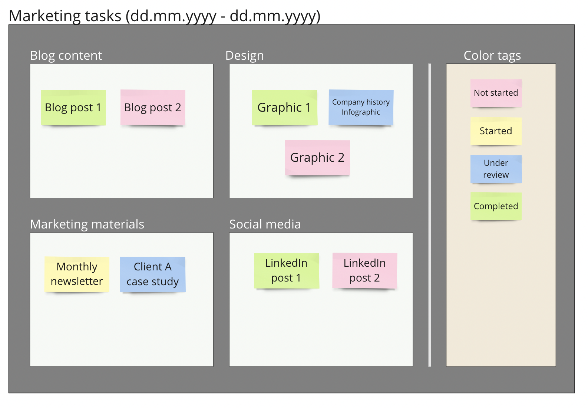

# Categorize items by color

Use custom color tags to track the changing state of data items in your spatial table. You can use this feature to indicate the completion state of tasks (e.g., Not started, Started, Under review, Completed). You can also use it to describe many other parameters based on your dataset (e.g., level of item importance,  level of customer satisfaction).

Define as many color states as you prefer by adding colored sticky notes with the appropriate label within a rectangle called "Color tags".

When used for tracking tasks, **this technique can be great alternative to Kanban boards**, as it uses color to indicate state of task completion, while allowing for labeled rectangles to show supplementary task characteristics.

The example below shows how this approach can be used to track marketing tasks for a team. The states of completion are defined in the Color tags areas.&#x20;

<figure><figcaption></figcaption></figure>

#### Results table view

The color status for each item in the results table based on the spatial table above appears in the _Color Labels_ column. Such a column will only be visible by default if the associated spatial table contains a Color tags label category.

Color tags can be used alongside other categorization methods supported by the app. The table below, for example, also shows a two-level vertical category hierarchy.

<figure><figcaption></figcaption></figure>

### Find out more:

<table data-card-size="large" data-view="cards"><thead><tr><th></th><th></th><th></th><th data-hidden data-card-target data-type="content-ref"></th></tr></thead><tbody><tr><td><strong>Practical tips:</strong></td><td>Working with color tags</td><td></td><td><a href="practical-tips.md#working-with-color-tags">#working-with-color-tags</a></td></tr></tbody></table>
