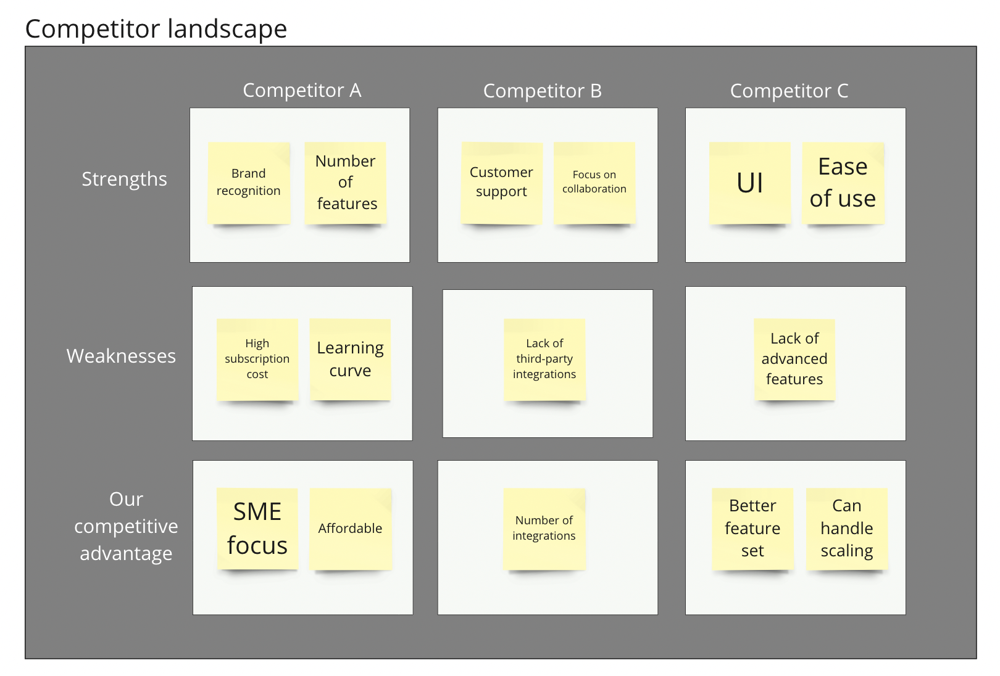

# Categorize items by using row and column labels

Visually place sticky notes or text box data items into table cells (rectangles) that are associated with both vertical and horizontal labels. This feature helps you compare data items across different categories and identify items that have similar or distinct features. Working within this familiar table view, you can organize your data visually, making it easier to spot patterns and insights.

Benefit from being able to include multiple items per cell, which can be resolved in the results table view.&#x20;

The spatial table below illustrates a straightforward example of using vertical and horizontal labels to analyze the strengths and weaknesses of a company's competitors, as well as its competitive advantages.

<figure><figcaption></figcaption></figure>

#### Results table view

The results table view shows the vertical categories using [hierarchies](categorize-using-hierarchies.md). Horizontal labels are included in a separate column. The table has been [sorted ](../results-tables/sort.md)based on horizontal labels.&#x20;

<figure><figcaption></figcaption></figure>

### Find out more:

<table data-card-size="large" data-view="cards"><thead><tr><th></th><th></th><th></th><th data-hidden data-card-target data-type="content-ref"></th></tr></thead><tbody><tr><td><strong>Practical tips:</strong></td><td>Assigning vertical labels</td><td></td><td><a href="practical-tips.md#assigning-vertical-labels">#assigning-vertical-labels</a></td></tr><tr><td><strong>Practical tips:</strong></td><td>Assigning horizontal labels</td><td></td><td><a href="practical-tips.md#assigning-horizontal-labels">#assigning-horizontal-labels</a></td></tr></tbody></table>
