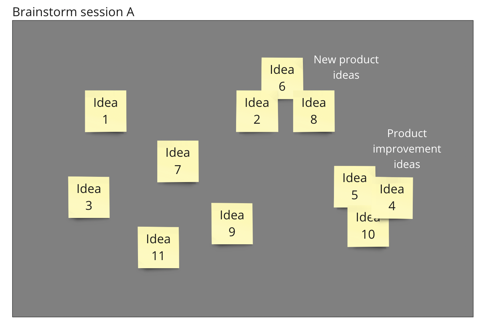
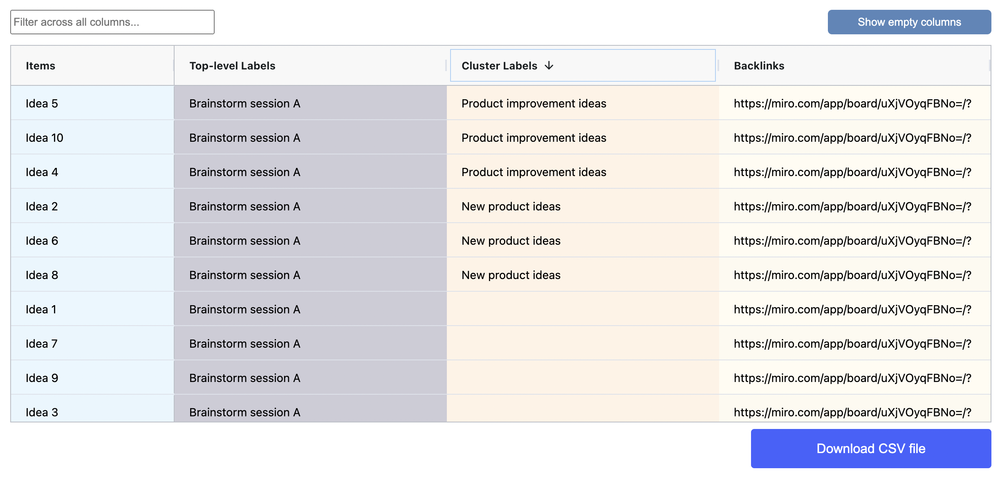

# Label sticky note clusters

Arrange your sticky notes in a cluster by overlapping them, and assign a label to the cluster.&#x20;

This allows you to organize your notes visually without relying on hierarchies alone. The feature can be used as a complement to hierarchy-based categorization or as a standalone method.

The spatial table example below shows using sticky note cluster labels to place ideas in _New product ideas_ and _Product improvement ideas_ categories during a brainstorming session.

<figure><figcaption></figcaption></figure>

#### Results table view

In the results table, each item's association with a cluster label is displayed in the Cluster Labels column. This column is only visible by default if the spatial table contains labeled clusters.

<figure><figcaption></figcaption></figure>
