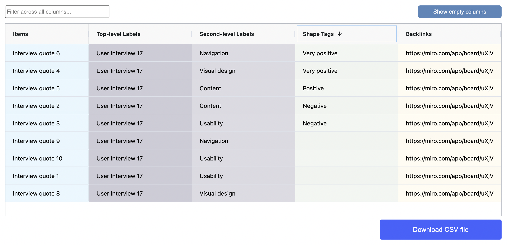

# Tag items using shapes

Use custom shape tags to assign label categories to sticky notes in your spatial tables. This feature enables you to quickly define and apply multiple tags to your data sets by simply copying and pasting shapes on top of sticky notes, providing a simple and fast way to visually organize and categorize your data.

Shape tagging is especially useful when you need to keep track of and assign multiple tags simultaneously. You can use this feature to assign tasks to people or associate tasks with additional labels.

In the spatial table example below, shape tags are used to indicate the level of user enthusiasm during a quotable moment in a user interview.

<figure><figcaption></figcaption></figure>

#### Results table view

The shape tags for each item in the results table based on the spatial table above appears in the _Shape Tags_ column. Such a column will only be visible by default if the associated spatial table contains a Shape tags label category.

Shape tags can be used alongside other categorization methods supported by the app. The table below, for example also shows a two level vertical category hierarchy.&#x20;

<figure><figcaption></figcaption></figure>


When you apply multiple shape tags to a single sticky note in a spatial table, each tag is resolved to a separate row in the results table. This feature makes filtering and querying data easier.


### Find out more:

<table data-card-size="large" data-view="cards"><thead><tr><th></th><th></th><th></th><th data-hidden data-card-target data-type="content-ref"></th></tr></thead><tbody><tr><td><strong>Practical tips:</strong></td><td>Working with shape tags</td><td></td><td><a href="practical-tips.md#working-with-shape-tags">#working-with-shape-tags</a></td></tr></tbody></table>
