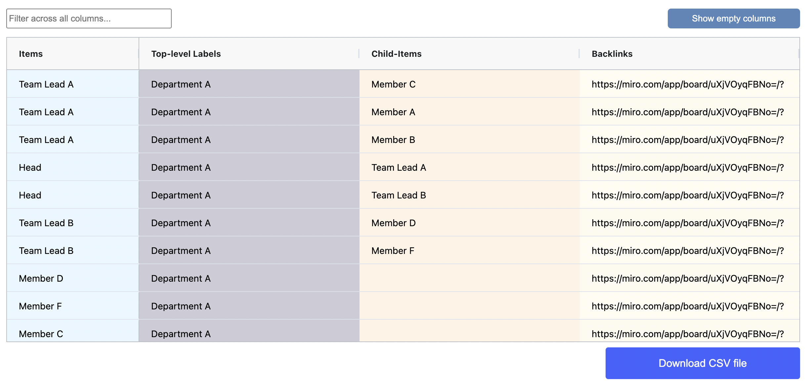

# Use connector lines

Connector lines are a powerful tool for establishing direct parent-child relationships between individual sticky notes or text boxes. They are particularly useful when the relationship lies outside of the spatial table hierarchy.

&#x20;Connector lines can indicate dependencies between data items from different hierarchical categories, or they can create hierarchies in their own right.

In the example below, connector lines are used to illustrate the organizational structure within a department.

<figure><figcaption></figcaption></figure>

#### Results table view

The results table displays the relationship between parent and child items in the Child-items column, which is only visible if the spatial table includes line connectors. The column illustrates how each child item is linked to its respective parent item.

<figure><figcaption></figcaption></figure>

### Find out more:

<table data-card-size="large" data-view="cards"><thead><tr><th></th><th></th><th></th></tr></thead><tbody><tr><td><strong>Practical tips:</strong></td><td>Using line connectors</td><td></td></tr></tbody></table>
